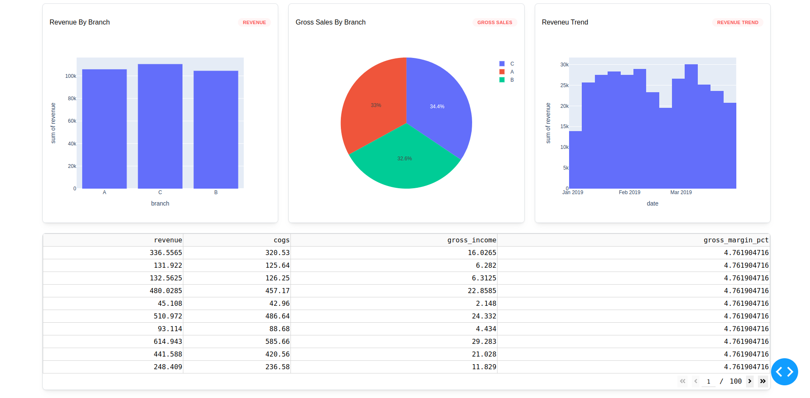

# Dash Projects

## About

This set of projects aims at learning data visualization for web applications using dash, a Python Library similar to Flask.

## File Structure

# 1. basics Folder

This folder contains the fundamentals of dash. In this folder, you'll find files like `app_01.py` each file has its own use case

> [basics/part_01/app_01]() creating very basic app

> [basics/part_01/app_02]() loading data

> [basics/part_01/app_03]() data visualizatioin

> [basics/part_01/app_04]() Callbacks and controls

> [basics/part_02/app_01]() Styling components

# Styling Components In Dash

In `Dash` there are several ways we can use to style components.

1. HTML and CSS
2. [Dash Design Kit (DDK)](https://plotly.com/dash/design-kit/)
3. [Bootstrap Dash Components](https://dash-bootstrap-components.opensource.faculty.ai/docs/)
4. [Dash Mantine Components](https://www.dash-mantine-components.com/components/container)

### Project Draft 01

